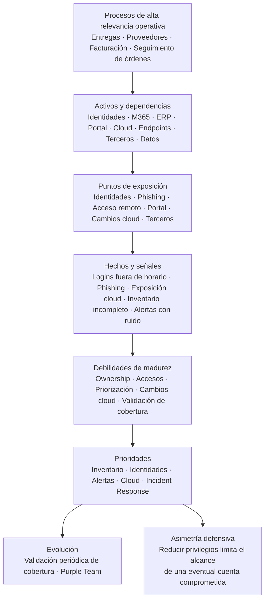

# Análisis defensivo — Fintrade Logistics

> Escenario de laboratorio sobre una organización ficticia.

## Objetivo del análisis

Construir una visión defensiva inicial de Fintrade Logistics antes de trasladar las conclusiones a los informes técnico y ejecutivo.

El análisis busca responder cuatro preguntas:

- qué parte de la operación necesita protección;
- qué activos y dependencias sostienen esa operación;
- qué puntos de exposición y señales requieren atención;
- qué capacidades deberían priorizarse para mejorar la postura defensiva.

---

## 1. Procesos de alta relevancia operativa

La operación presenta una fuerte dependencia de servicios digitales para coordinar:

- entregas;
- gestión de proveedores;
- facturación;
- seguimiento de órdenes.

Estos procesos son prioritarios para el análisis porque forman parte directa de la operación descrita.

No existe información suficiente para asignarles una clasificación formal de criticidad. Esa valoración debería validarse mediante un análisis de impacto de negocio y un relevamiento más completo de dependencias.

---

## 2. Activos y dependencias relevantes

### Identidades, accesos y privilegios

El entorno utiliza distintos niveles de privilegio y accesos remotos para personal administrativo y técnico.

La revisión periódica de accesos es escasa, por lo que las identidades y privilegios constituyen una dependencia transversal que debe conocerse y gestionarse con precisión.

### Microsoft 365

Microsoft 365 se utiliza intensivamente para correo, colaboración y almacenamiento.

Esto lo convierte en un servicio relevante para la operación, aunque el escenario no permite determinar qué procesos dependen directamente de cada una de sus capacidades.

### ERP

Existe un ERP accesible desde la red interna.

Debe incluirse dentro del inventario y relacionarse con los procesos que soporta. No se detallan sus funciones concretas ni sus dependencias técnicas.

### Portal para clientes y proveedores

La organización dispone de un portal web utilizado por clientes y proveedores.

Es un componente relevante por su exposición a usuarios externos, pero no se especifica qué procesos internos consume, qué datos procesa ni cómo se integra con otros sistemas.

### Infraestructura y servicios cloud

La organización utiliza infraestructura y servicios cloud.

El entorno técnico incluye capacidades de identidad, desarrollo, repositorios, pipelines, registro de contenedores, runtime en Kubernetes, políticas, gestión de secretos, base de datos, observabilidad, infraestructura como código y acceso de usuarios.

Ese conjunto no representa por sí solo toda la arquitectura organizacional: también deben integrarse Microsoft 365, ERP, endpoints, acceso remoto y soporte IT tercerizado.

### Endpoints y acceso remoto

Los endpoints corporativos están distribuidos entre oficina y trabajo remoto.

Además, existe acceso remoto para personal administrativo y técnico. Esto amplía el entorno defensivo más allá de una red interna única y obliga a considerar dispositivos, identidades y mecanismos de acceso como dependencias relacionadas.

### Soporte IT tercerizado

Parte del soporte IT está tercerizado.

Esto introduce una relación de confianza y una dependencia operativa que debe relevarse en términos de accesos, permisos, responsabilidades y alcance.

La existencia del tercero no implica por sí misma una vulnerabilidad.

### Datos operativos y de negocio

La operación depende de información relacionada con órdenes, entregas, proveedores, facturación y clientes.

Su protección debe considerar confidencialidad, integridad y disponibilidad según el impacto que tenga cada proceso.

---

## 3. Dependencias que todavía deben relevarse

Con la información disponible pueden identificarse componentes relevantes, pero no construir un mapa definitivo de dependencias.

Deben relevarse, como mínimo:

- qué aplicaciones soportan cada proceso;
- qué identidades y privilegios permiten acceder a cada servicio;
- qué datos utiliza y genera cada proceso;
- qué componentes cloud sostienen servicios relevantes;
- qué accesos posee el soporte IT tercerizado;
- qué endpoints intervienen en tareas administrativas y técnicas;
- qué relaciones existen entre Microsoft 365, ERP, portal web y otros servicios.

---

## 4. Puntos de exposición y señales observadas

### Identidades y autenticación

**Hecho:** se observaron múltiples inicios de sesión fuera de horario utilizando cuentas válidas.

**Inferencia:** la actividad merece investigación porque puede representar comportamiento anómalo, pero no demuestra por sí sola que las cuentas hayan sido comprometidas.

**Recomendación:** revisar accesos, privilegios, patrones de autenticación y mecanismos de autenticación donde corresponda.

### Correo y usuarios administrativos

**Hecho:** dos campañas de phishing afectaron a usuarios administrativos.

**Limitación:** el escenario no permite afirmar que las campañas hayan sido dirigidas específicamente a esos usuarios ni que Microsoft 365 haya sido necesariamente el canal utilizado.

**Recomendación:** revisar controles de correo, señales de identidad y capacidad de detección y respuesta frente a phishing.

### Acceso remoto y endpoints

**Hecho:** existen endpoints distribuidos entre oficina y trabajo remoto, junto con acceso remoto para personal administrativo y técnico.

**Inferencia:** estos elementos amplían la superficie que debe monitorearse.

No existe evidencia suficiente para afirmar que los mecanismos de acceso remoto o los endpoints presenten una vulnerabilidad concreta.

### Portal web

**Hecho:** existe un portal para clientes y proveedores.

**Inferencia:** por estar expuesto a usuarios externos, debe formar parte del relevamiento de superficie de ataque.

No se aportan evidencias de vulnerabilidades específicas en el portal.

### Cloud y cambios operativos

**Hecho:** un recurso cloud quedó expuesto accidentalmente durante un cambio operativo.

**Inferencia:** el proceso de cambios y configuración puede introducir exposición si no existe una validación suficiente.

**Recomendación:** fortalecer controles de configuración y validaciones antes y después de cambios relevantes.

### Terceros

**Hecho:** parte del soporte IT está tercerizado.

**Inferencia:** existe una relación de confianza que debe incorporarse al análisis de accesos y responsabilidades.

No existe evidencia suficiente para afirmar que el tercero sea inseguro.

---

## 5. Debilidades de madurez

Las principales debilidades observadas no derivan de una ausencia total de herramientas, sino de la forma en que el entorno se conoce, se prioriza y se opera.

### Inventario no consolidado

La organización no dispone de un inventario consolidado.

Esto dificulta determinar con precisión:

- qué existe;
- qué debe monitorearse;
- qué activo sostiene cada proceso;
- quién debe responder por cada componente.

### Ownership incompleto

No todos los activos críticos tienen un responsable claramente asignado.

Esto puede dificultar decisiones de priorización, escalamiento y respuesta.

### Revisión de accesos insuficiente

La revisión periódica de accesos es escasa.

En un entorno con distintos niveles de privilegio y acceso remoto, esta situación justifica revisar sistemáticamente permisos, privilegios y cuentas.

### Ruido y poca priorización de alertas

Las alertas existen, pero generan mucho ruido y poca priorización.

La brecha no parece estar únicamente en generar telemetría, sino en convertirla en señales útiles para la operación defensiva.

### Gestión de cambios cloud

La exposición accidental de un recurso durante un cambio evidencia la necesidad de mejorar la validación de configuraciones y cambios.

### Validación de cobertura

No existen ejercicios formales de Purple Team ni validaciones periódicas de cobertura.

Por lo tanto, la organización no dispone de suficiente evidencia para saber si sus controles y detecciones funcionan como espera frente a comportamientos adversarios relevantes.

---

## 6. Objetivos iniciales del Blue Team

A partir del escenario, los objetivos defensivos iniciales deberían ser:

1. **Obtener claridad del entorno**  
   Consolidar inventario, dependencias, ownership y contexto de negocio.

2. **Fortalecer identidades, accesos y privilegios**  
   Revisar permisos, privilegios, accesos remotos y mecanismos de autenticación donde corresponda.

3. **Mejorar visibilidad y capacidad de detección**  
   Priorizar telemetría relevante y reducir ruido antes de ampliar indiscriminadamente el monitoreo.

4. **Validar y fortalecer la capacidad de respuesta**  
   Revisar cómo se investigan, escalan, contienen y documentan eventos e incidentes.

5. **Fortalecer cambios y configuraciones cloud**  
   Reducir la posibilidad de introducir exposición mediante cambios operativos.

6. **Evolucionar hacia validación continua**  
   Incorporar progresivamente validaciones de cobertura y prácticas Purple Team cuando las capacidades básicas estén suficientemente ordenadas.

---

## 7. Priorización defensiva

Si solo pudieran ejecutarse cinco acciones iniciales, el orden propuesto sería:

### 1. Consolidar inventario, dependencias y ownership

Permite saber qué existe, qué sostiene la operación y quién es responsable de cada activo.

### 2. Revisar identidades, accesos y privilegios

Incluye permisos, privilegios, accesos remotos y mecanismos de autenticación donde corresponda.

### 3. Mejorar calidad y priorización de alertas

El objetivo es convertir la telemetría existente en señales accionables y reducir el ruido operativo.

### 4. Fortalecer la validación de cambios y configuraciones cloud

Busca reducir nuevas exposiciones accidentales y detectar configuraciones inseguras antes de que generen impacto.

### 5. Validar y fortalecer Incident Response

El escenario no demuestra que Incident Response sea inexistente.

La recomendación es verificar cómo se investiga, escala, contiene, comunica y recupera frente a incidentes, y fortalecer esa capacidad donde sea necesario.

---

## 8. Asimetría defensiva

La gestión de identidades, accesos y privilegios ofrece una de las mejores asimetrías iniciales.

Si una cuenta válida fuera comprometida, reducir privilegios innecesarios y limitar accesos puede disminuir el alcance que un atacante obtendría utilizando mecanismos legítimos.

La ventaja defensiva consiste en imponer más fricción al movimiento del atacante mediante controles que, al mismo tiempo, mejoran la gobernanza cotidiana del entorno.

---

## 9. Mapa defensivo

---

## Conclusión

La principal debilidad de Fintrade no parece ser la falta de productos de seguridad, sino la ausencia de una visión suficientemente consolidada del entorno y de la madurez de sus capacidades defensivas.

La prioridad inicial es ganar claridad sobre activos, dependencias, ownership e identidades; después, mejorar la calidad de la detección, fortalecer los cambios cloud y validar la capacidad real de respuesta.

La evolución hacia prácticas Purple Team tiene sentido como una etapa posterior de madurez, cuando las capacidades básicas ya puedan medirse y mejorarse de forma consistente.
